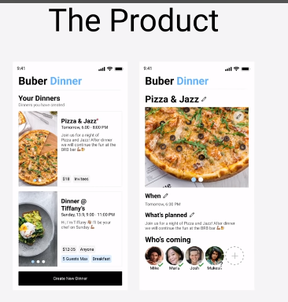
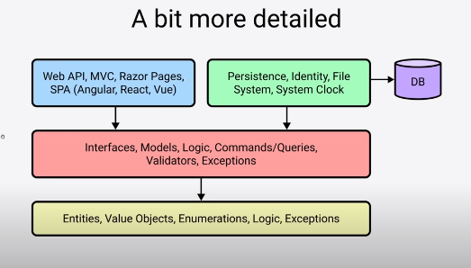
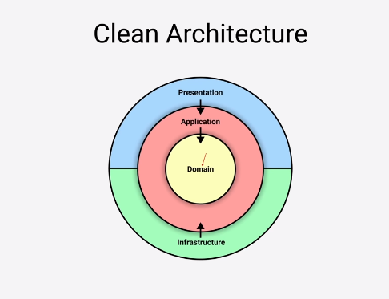
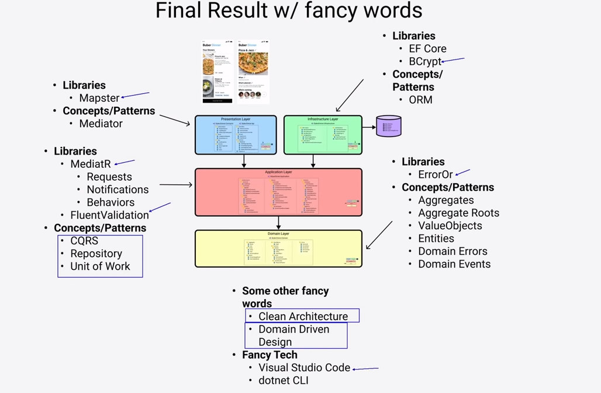

# [.NET6 REST API with CLEAN Architecture & DDD](https://www.youtube.com/playlist?list=PLzYkqgWkHPKBcDIP5gzLfASkQyTdy0t4k) 🤓

## Overview

***API*** built by scratch using ***DDD*** *(domain driven design)*, in this course/tutorial we gonna implement a **dinner hosting platform**, think it like uber but to host dinner at your house 🤔.

## Clean Architecture 🤰 

  
  

<!--  -->

In This implementation we're gonna be using the Clean Architecture approach, as we can see by the graph, also descbribed as an onion style, the purpose is to detach varios fundamental parts of our app from each other.

